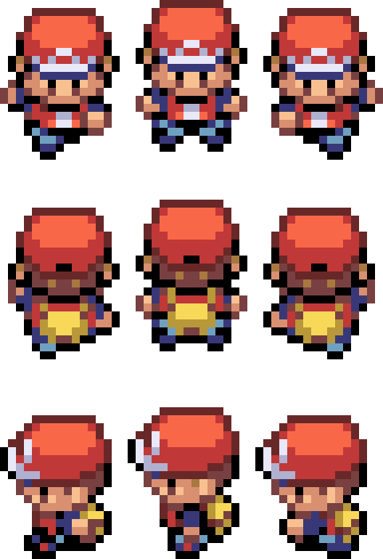

**Nome do Projeto:** _Arkplains: Crônicas de Arkadia. (nome provisório)_ 

O nome foi escolhido especialmente para ser o mais genérico o possível.
personagens feitos em um estilo medieval (isekai). Confira: [[Personagens#]].
mecânicas básicas do jogo disponíveis em: [[Mecânicas#]].

**Estilo de Visual:** _Pixel Art / Estilo retrô, top-down._ 
**Gênero:** _RPG 2D, Combate em Turnos._ 

|  |
| -------------------------------------------------- |

**Plataforma-alvo:** _PC (Windows/Linux), possível exportação futura para mobile._ 

              

**Motor de Jogo:** _Godot Engine 4.4.1._ 
**Linguagem de Programação:** _C# (.Net core)._ 

      

---
